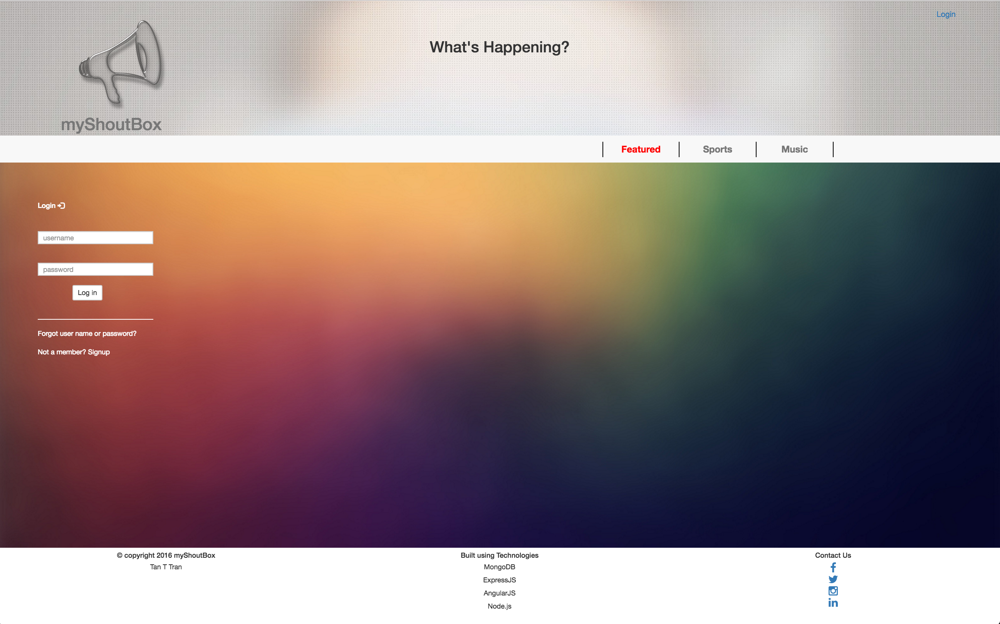
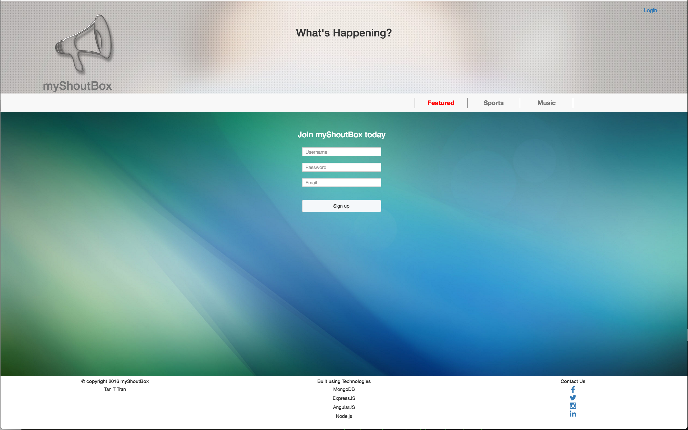
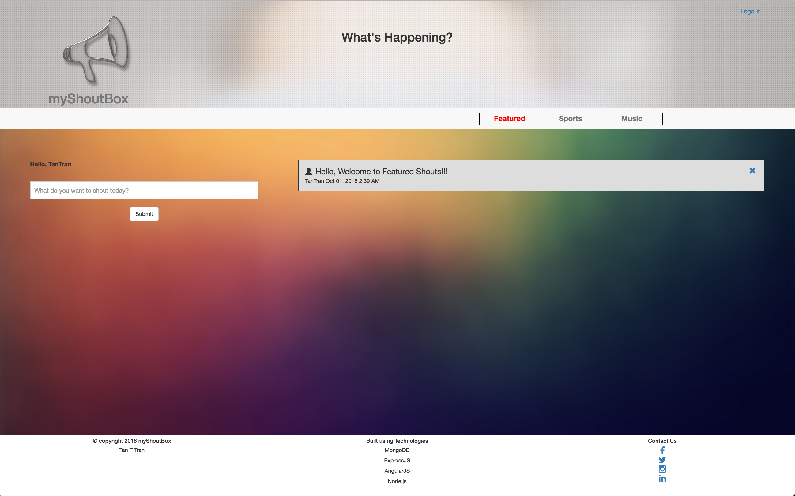

# myshoutbox
A web application that allow registered members to broadcast their posts.

Demo - https://tanttran-myshoutbox.herokuapp.com/

Build Using the Following Technologies:
- NodeJS
- ExpressJS
- AngularJS
- MongoDB

How to Use:

1. Sign up for an account by clicking sign up link.
2. Enter your login infos and submit.
3. Go back to the main page and login with your user infos.
4. You should be able to shout in the featured sections.  
   Select where you want to broadcast your posts at and Have fun.

